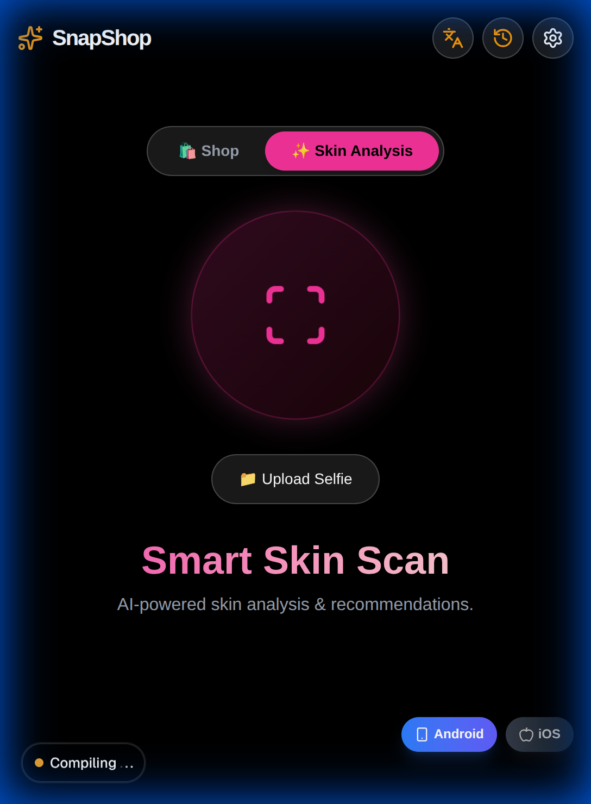
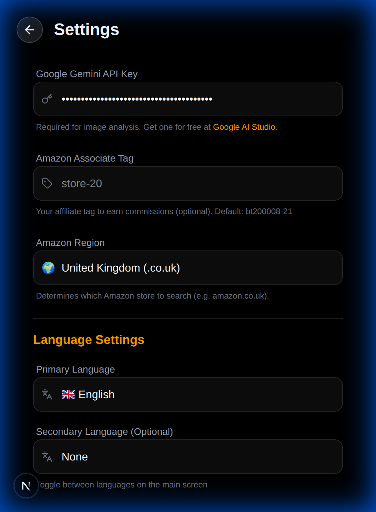

# 📸 SnapShop: AI-Powered Skin Analysis & Smart Shopping

SnapShop is a modern, high-performance web and mobile application that leverages **Google's Gemini 2.0 Flash AI** to provide instant product recognition and deep skin analysis. Whether you're looking for the best price on a product you see or need personalized skincare advice, SnapShop is your AI companion.


---

## 📱 Project Preview

<div align="center">
  
  
  
</div>

---

## ✨ Key Features

-   **🛍️ Smart Shopping Mode**: Capture any product with your camera to identify it instantly. Get price estimates and direct links to Amazon with your affiliate tag integration.
-   **✨ AI Skin Analysis**: Take a selfie to receive a comprehensive analysis of your skin type, concerns (e.g., oiliness, sensitivity), and undertones. Get personalized skincare routine recommendations.
-   **🌍 Multi-Language Support**: Fully localized in English, Hindi, Chinese, French, Spanish, and German. Results are translated on-the-fly using AI.
-   **📱 Cross-Platform**: Runs perfectly in the browser as a PWA or on Android/iOS via Capacitor.
-   **🔊 Voice Insights**: Integrated Text-to-Speech (TTS) for hands-free analysis feedback.
-   **📜 Scan History**: Save and revisit your previous scans and analyses locally on your device.

---

## 🛠️ Tech Stack

-   **Frontend**: [Next.js](https://nextjs.org/) (App Router), [React 19](https://react.dev/)
-   **Styling**: [Tailwind CSS 4](https://tailwindcss.com/), [Framer Motion](https://www.framer.com/motion/) for animations.
-   **AI Engine**: [Google Generative AI (Gemini 2.0 Flash)](https://ai.google.dev/)
-   **Mobile/Native**: [Capacitor](https://capacitorjs.com/) for Android & iOS support.
-   **PWA**: [Serwist](https://serwist.js.org/) for offline capabilities and service workers.
-   **Icons**: [Lucide React](https://lucide.dev/)

---

## 🚀 Getting Started

### Prerequisites

-   Node.js 18+ and npm
-   A Gemini API Key (Get one at [Google AI Studio](https://aistudio.google.com/))

### Installation

1.  **Clone the repository**:
    ```bash
    git clone https://github.com/coolshell2000/snapshop.git
    cd snapshop
    ```

2.  **Install dependencies**:
    ```bash
    npm install
    ```

3.  **Run the development server**:
    ```bash
    npm run dev
    ```
    Open [http://localhost:3000](http://localhost:3000) to see the app.

---

## 📱 Mobile Build (Android)

SnapShop is optimized for mobile devices. To build the Android APK:

1.  Ensure you have the Android SDK and Java installed.
2.  Run the automated build script:
    ```bash
    ./build-android.sh
    ```
    *Refer to [ANDROID_BUILD.md](./ANDROID_BUILD.md) for detailed prerequisites and manual build steps.*

---

## ⚙️ Configuration & Environment

-   **API Key**: You can set your Gemini API Key directly in the app's **Settings** menu. It is stored securely in your browser's `localStorage`.
-   **Amazon Affiliate**: Enter your Amazon Associate tag in settings to monetize links generated by the app.
-   **Region**: The app automatically detects your region for accurate Amazon product pricing but can be overridden in settings.

---

## 🤝 Contributing

Contributions are welcome! If you have a feature request or bug report, please open an issue or submit a pull request.

---

## ⚖️ Disclaimer

-   **Skincare Advice**: The AI skin analysis is for informational/cosmetic purposes only. It is NOT medical advice. Always consult a dermatologist for skin conditions.
-   **Affiliate Links**: This app may generate Amazon affiliate links. Purchases made through these links may earn the developer a commission.

---

Built with ❤️ by the SnapShop Team.
